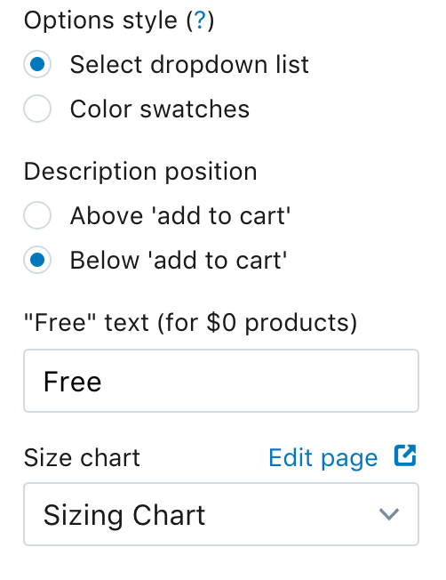

# Printful sizing guides for shopify store

Drop in sizing guides for [printful.com](https://www.printful.com/a/106249:131f9139b085f24eb49ef31f9d0bf33c) products in your shopify store.

## Demo

Just click on any product page and then click "Size Guide".

[Hen Outdoors](https://henoutdoors.com)

## Getting Started

First add the [size-chart.liquid](size-chart.liquid) file to your stores `snippets` folder.

Include the size-chart file. Copy and paste this line into your stores `theme.liquid` file:

```
    
      <div id="size-chart">
        <div id="chart-type" style="display: 'inline-block'; verticalAlign: 'middle'; borderLeft: '1px solid #cdcdcd'; height: '30px';">
          <a class="US">US Sizes</a> | <a class="metric">Metric sizes</a>
        </div>
        
        {{ pages[settings.size_chart].content }}
      </div>
    
```

Go into your theme options (Product Page) and find the sizing guide in the dropdown list.



## Mapping products to printful

Now that everything is added to your store, you need to map all your products to the correct printful id.

## License

This project is licensed under the MIT License - see the [LICENSE.md](LICENSE.md) file for details